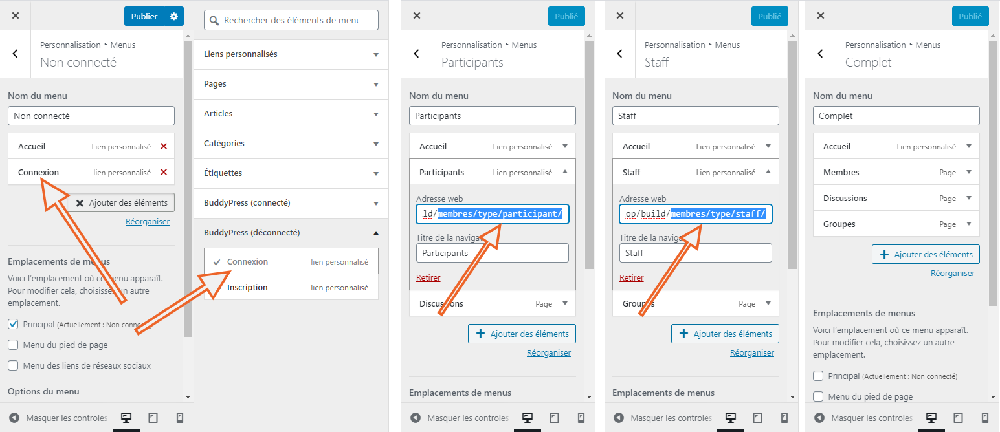

# vingtdixneuf

Un thème enfant de TwentyNineteen pour illustrer comment mettre en place des zones réservées par type de membre BuddyPress.

## Définir les types de membre BuddyPress

Voir la fonction `vingtdixneuf_register_member_types_with_directory()` du fichier [inc/bp-customs.php](./inc/bp-customs.php)

## Créer des menus WordPress

### Menu Non connecté

- Créer un menu "Non connecté" et définir son emplacement sur Principal.
- Ajouter l'accueil et la navigation connexion de la section "BuddyPress

### Menu Participants

- Créer un menu "Participants" sans définir son emplacement.
- Ajouter l'accueil, un lien personnalisé vers la page des membres de ce type (ex: site.url/membres/**type/participants/**) et la ou les pages de BuddyPress de votre choix ("Discussions" est la page des activités dans mon exemple).

### Menu Staff

- Créer un menu "Staff" sans définir son emplacement.
- Ajouter l'accueil, un lien personnalisé vers la page des membres de ce type (ex: site.url/membres/**type/staff/**) et la ou les pages de BuddyPress de votre choix (la page des groupes dans mon exemple).

## Adapter le thème enfant

Voir les lignes 33 à 93 du template [site-branding.php](./template-parts/header/site-branding.php)

## Personnaliser le chargement des pages de BuddyPress

Voir la fonction `vingtdixneuf_user_router()` du fichier [inc/bp-customs.php]
